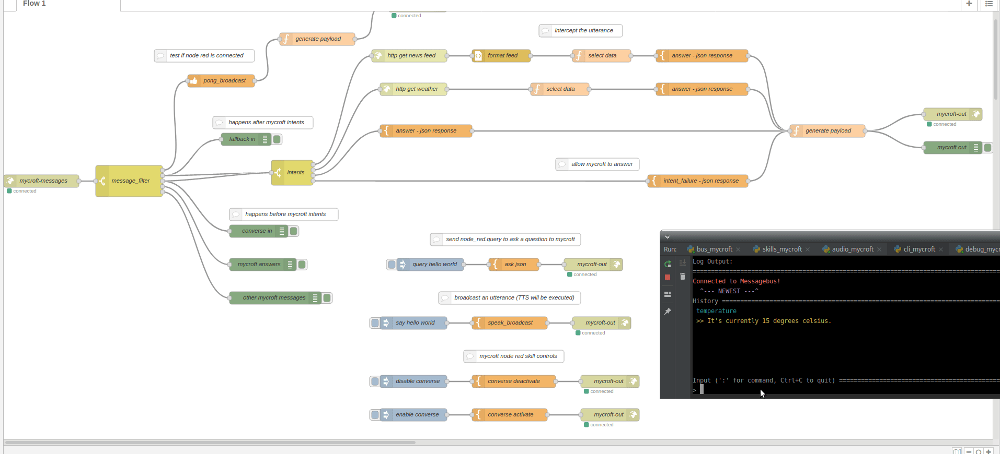

# node red mycroft skill

[Node Red](https://nodered.org/) - Mycroft interface

beginners and non technical users can now leverage visual programming and easily extend mycroft functionality

# Sample flow

flows should open a websocket connection to communicate with mycroft

    ws://username:secret@127.0.0.1:6789

# Installing node red

you might  need to install

    apt-get install libssl-dev libffi-dev
    
read the Node Red [Getting Started Guide](https://nodered.org/docs/getting-started/)

## Node red auto start

node red must be running, it can be started with

     node-red-start

or made into a service

    sudo systemctl enable nodered.service
    sudo service nodered start
    check to see if node-red is running at http://127.0.0.1:1880

# Importing flows...

- Copy the JSON text from [sample_flow.txt](https://github.com/JarbasSkills/mycroft-node-red/blob/master/sample_flow.txt)
- Go to http://noderedip:1880
- In the upper righthand corner menu, choose... Import > Clipboard
- This will open the "Import nodes window"
- Paste the contents from the sample_flow.txt
- Click on Import and the flow should appear
- Next click on Deploy
- After you deploy, the websocket nodes should say 'connected' if the skill was installed properly

# web chat in node red

we can also ask mycroft questions from inside node red

a sample web chat is provided, you can extend this to execute TTS in browser

deploy the contents of [web_chat_flow.txt](https://github.com/JarbasSkills/mycroft-node-red/blob/master/web_chat_flow.txt)

web chat available at

    http://noderedip:1880/ui/

