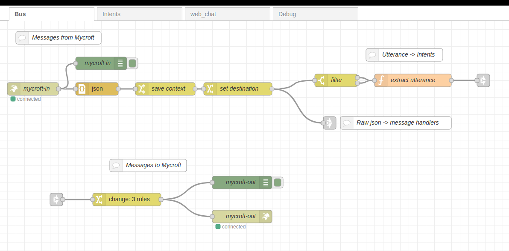
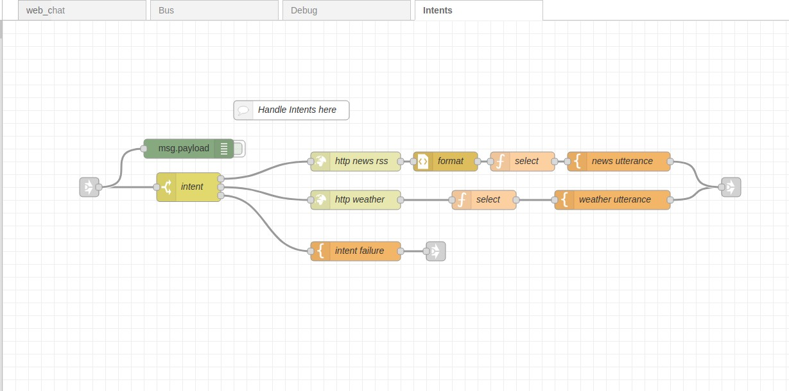
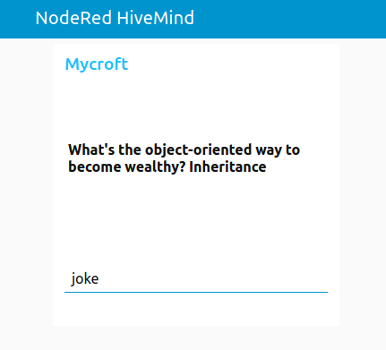
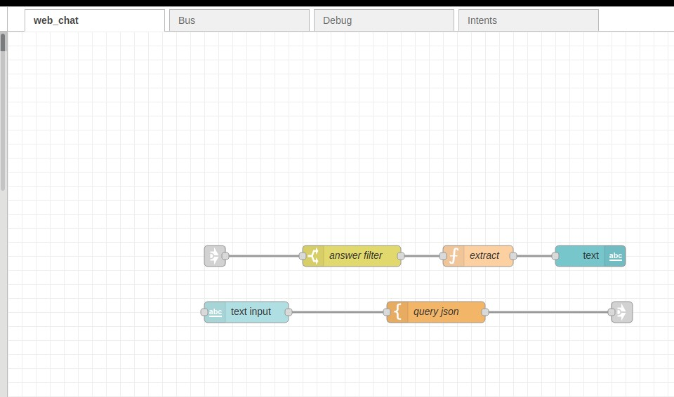
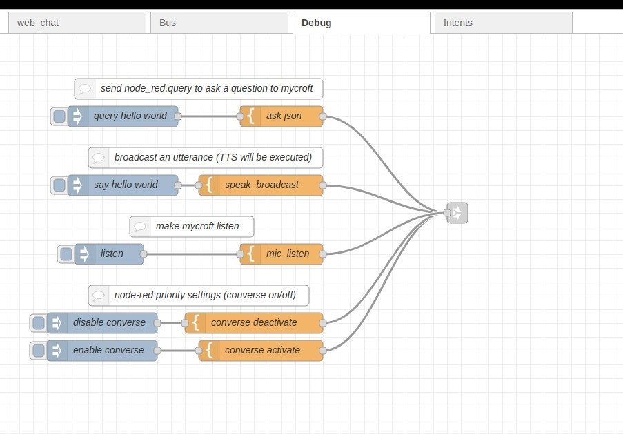

# NodeRed mycroft skill

[Node Red](https://nodered.org/) - Mycroft interface

beginners and non technical users can now leverage visual programming and easily extend mycroft functionality

- [NodeRed mycroft skill](#nodered-mycroft-skill)
- [Additional Setup](#additional-setup)
  * [Installing node red](#installing-node-red)
    + [Firewall](#firewall)
    + [Launch Node red](#launch-node-red)
  * [Import base flows](#import-base-flows)
  * [Configure keys](#configure-keys)
  * [Build Intents](#build-intents)
- [Extra functionality](#extra-functionality)
  * [Webui](#webui)
  * [Debug](#debug)


# Additional Setup

After installing the node red skill you need to deploy some flows in node red

## Installing node red

you might  need to install

```bash
apt-get install libssl-dev libffi-dev
```
    
read the Node Red [Getting Started Guide](https://nodered.org/docs/getting-started/)

### Firewall

Node red can be running in any machine, does not need to run in same 
place as mycroft, if this is the case open port 6789 in mycroft

```bash
sudo ufw allow 6789
```

Note that it is node red that starts a connection to mycroft, not the other 
way around

### Launch Node red

node red must be running, it can be started with

```bash
 node-red-start
```

or made into a system service

```bash
sudo systemctl enable nodered.service
sudo service nodered start
```
   
verify that node-red is running at http://noderedip:1880


## Import base flows


- Copy the JSON text from [base_flows.json](base_flows.json)
- Go to http://noderedip:1880
- In the upper righthand corner menu, choose... Import > Clipboard
- This will open the "Import nodes window"
- Paste the contents from the sample_flow.txt
- Click on Import and the flow should appear
- Next click on Deploy
- After you deploy, the websocket nodes should say 'connected' if the skill was properly configured


## Configure keys

NodeRed will open a websocket connection to communicate with mycroft

    ws://username:secret@127.0.0.1:6789

username can be anything, secret is set in web ui of the skill

You need to edit mycroft-in and mycroft-out websocket nodes with the correct secret



## Build Intents
 
Edit intents flow to add your node red intents




# Extra functionality

There are 2 flows providing extra functionality

## Webui

A basic webchat is provided, you can access it at http://noderedip:1880/ui





## Debug

Test different payload with the debug flow

